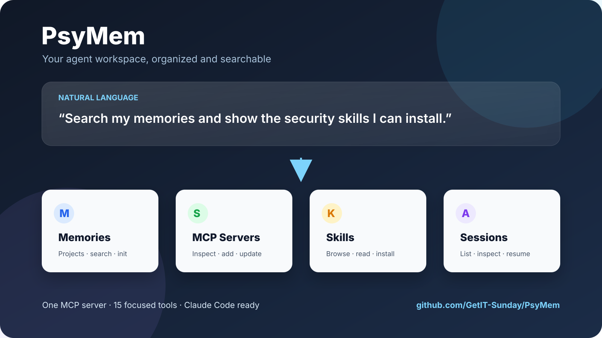
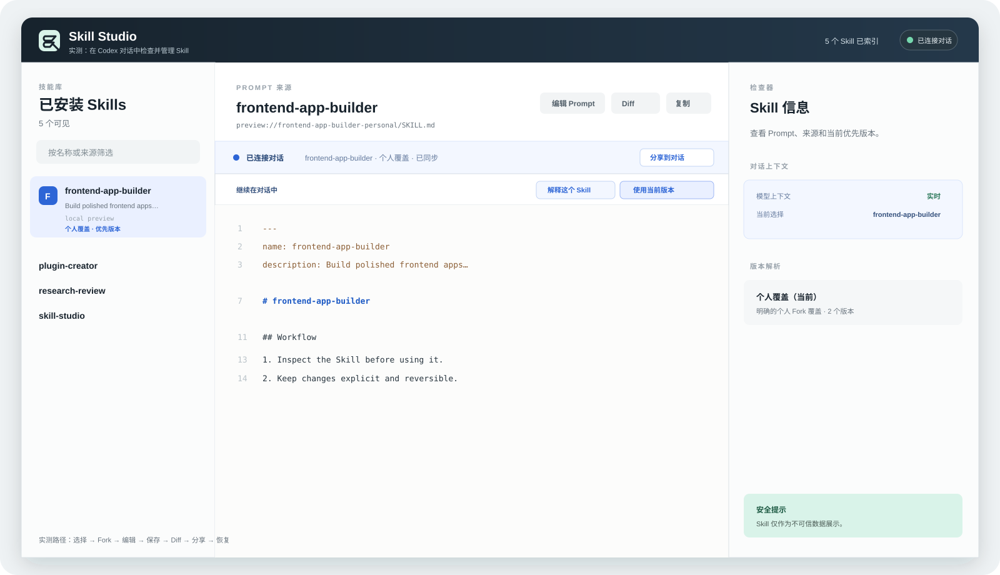

<a name="psymem"></a>
<p align="center">

</p>

<p align="center">
  <h1 align="center">🧠 PsyMem</h1>
  <p align="center">
    <strong>Skill Studio for Codex</strong><br>
    <em>Understand, review, edit, and safely use third-party Skills before they enter your workflow</em>
  </p>
  <p align="center">
    <a href="#-features">Features</a> •
    <a href="#-installation">Installation</a> •
    <a href="#-usage">Usage</a> •
    <a href="#-tools-15">Tools</a>
  </p>
</p>

<p align="center">
  
  
  
  
  
  
</p>

<p align="center">
  <strong>English</strong> | <a href="README_ZH.md">中文</a>
</p>
---
## ✨ Why Skill Studio?

Downloading a Skill should not mean trusting a black box. Skill Studio gives you a clear review-and-control loop inside Codex:

<p align="center"><strong>Inspect → Explain → Fork → Edit → Diff → Select the preferred version → Share to chat</strong></p>

<table>
  <tr>
    <td width="50%">
      <h3>🔍 Inspect before you trust</h3>
      <ul>
        <li>Read a Skill's Prompt, source, and origin</li>
        <li>See which version is currently preferred</li>
        <li>Ask for a plain-language explanation before use</li>
      </ul>
    </td>
    <td width="50%">
      <h3>🛠️ Edit without breaking upstream</h3>
      <ul>
        <li>Fork a personal copy of any Skill</li>
        <li>Edit and save your Prompt safely</li>
        <li>Review changes with a focused Diff</li>
      </ul>
    </td>
  </tr>
  <tr>
    <td width="50%">
      <h3>💬 Connect it to the conversation</h3>
      <ul>
        <li>Share the selected Skill context into Codex</li>
        <li>Use the preferred version explicitly</li>
        <li>Restore the original when needed</li>
      </ul>
    </td>
    <td width="50%">
      <h3>🔧 Works with your existing setup</h3>
      <ul>
        <li>Built as a Codex Plugin + MCP server</li>
        <li>Works with local Skills already on disk</li>
        <li>TypeScript, MCP SDK, Zod validation</li>
        <li>15 tools, natural language interface</li>
      </ul>
    </td>
  </tr>
</table>

## 🧭 How it fits together

PsyMem keeps the Skill itself visible and controllable while you work in Codex.

<p align="center">

</p>

## 📦 Installation

```bash
git clone https://github.com/GetIT-Sunday/PsyMem.git
cd PsyMem
npm install
npm run build
```

Register the MCP server:

```bash
claude mcp add -s user psymem -- node /path/to/PsyMem/dist/index.js
```

Restart Codex, then open Skill Studio from the plugin interface.
---
## 💬 Usage

In Codex, use the Skill Studio panel to:

```
1. Select a third-party Skill.
2. Inspect its Prompt, source, and preferred version.
3. Choose **Explain this Skill** before using it.
4. Fork, edit, save, and review the Diff.
5. Share the selected version into the active conversation.
```

### A complete walkthrough

PsyMem maps natural-language requests to focused MCP tools and returns results you can continue to explore. With Skill Studio installed, Codex can inspect a Skill's Prompt, source, and preferred version before you use it or create a personal fork.

**Tested Skill Studio flow:** select a Skill → inspect the preferred version → fork a personal copy → edit and save the Prompt → open Diff → share the selection into the conversation → restore the original.

<p align="center">

</p>

## 🧩 Core MCP tools

Skill Studio is the primary experience. PsyMem also exposes the following MCP tools for local Skill discovery and compatibility:

| Tool | Description |
|------|-------------|
| `list_projects` | List all projects and memory status |
| `read_memory` | Read a project's memory file |
| `write_memory` | Create or update a memory file |
| `delete_memory` | Delete a memory file |
| `init_memory` | Initialize memory from template |
| `search_memories` | Cross-project memory search |
| `list_mcp_servers` | List configured MCP servers |
| `add_mcp_server` | Add an MCP server |
| `remove_mcp_server` | Remove an MCP server |
| `update_mcp_server` | Update MCP server config |
| `list_skills` | Browse Skills marketplace |
| `list_categories` | List all Skill categories |
| `read_skill` | View Skill details |
| `search_skills` | Search Skills |
| `install_skill` | Install a Skill |

## 📁 Project Structure

```
PsyMem/
├── src/
│   └── index.ts      # MCP server entry point (15 tools)
├── dist/             # Compiled output
├── package.json
└── tsconfig.json
```
---
## 🧪 Development

```bash
npm run build    # Compile TypeScript
npm start        # Start MCP server
```

## 🤝 Contributing

Contributions welcome — open an issue or PR.
---
## 📄 License

MIT — see [LICENSE](LICENSE) for details.

<p align="center">
  <strong>⭐ If PsyMem improved your Claude Code workflow, give it a Star!</strong>
</p>
<p align="center">
  <sub>Made with ✨ by <a href="https://github.com/GetIT-Sunday">GetIT-Sunday</a> using <a href="https://github.com/GetIT-Sunday/ReadmeMagic-github-readme-design-skill">ReadmeMagic</a></sub>
</p>

<a name="command-reference"></a>
## 🧭 Command Reference

Verified entry point:

```bash
npm run start
```
---
<p align="center">
  <a href="https://star-history.com/#GetIT-Sunday/PsyMem&Date">
    
  </a>
</p>
