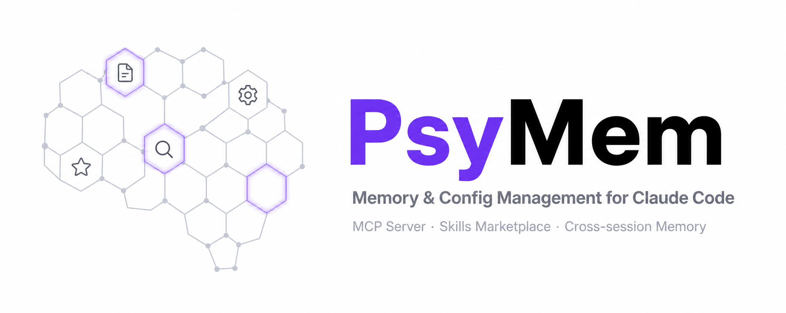

<a name="psymem"></a>
<p align="center">
  
</p>

<p align="center">
  <h1 align="center">🧠 PsyMem</h1>
  <p align="center">
    <strong>Memory & Config Management MCP Server for Claude Code</strong><br>
    <em>Manage memory files, MCP servers, and Skills — right inside your Claude Code conversation</em>
  </p>
  <p align="center">
    <a href="#-features">Features</a> •
    <a href="#-installation">Installation</a> •
    <a href="#-usage">Usage</a> •
    <a href="#-tools-15">Tools</a>
  </p>
</p>

<p align="center">
  
  
  
  
  
  
</p>

<p align="center">
  <strong>English</strong> | <a href="README_ZH.md">中文</a>
</p>

---

## ✨ Features

<table>
  <tr>
    <td width="50%">
      <h3>🗂️ Memory Management</h3>
      <ul>
        <li>View all projects and their memory file status</li>
        <li>Read / write / delete project memory files</li>
        <li>Initialize memory from templates: <code>project</code>, <code>personal</code>, <code>security</code></li>
        <li>Cross-project memory search</li>
      </ul>
    </td>
    <td width="50%">
      <h3>⚙️ MCP Server Management</h3>
      <ul>
        <li>View configured MCP servers (global + project-level <code>.mcp.json</code>)</li>
        <li>Add / remove / update MCP server configs</li>
        <li>Manage both user-scope and project-scope servers</li>
      </ul>
    </td>
  </tr>
  <tr>
    <td width="50%">
      <h3>🛒 Skills Marketplace</h3>
      <ul>
        <li>Browse the Claude Code Skills marketplace</li>
        <li>Filter by category: development, security, monitoring, etc.</li>
        <li>Sort by recommendation (vendor-signed skills first)</li>
        <li>Install Skills directly from within Claude Code</li>
      </ul>
    </td>
    <td width="50%">
      <h3>🔧 Zero Friction Setup</h3>
      <ul>
        <li>Single <code>claude mcp add</code> command to register</li>
        <li>Works immediately after Claude Code restart</li>
        <li>TypeScript, MCP SDK, Zod validation</li>
        <li>15 tools, natural language interface</li>
      </ul>
    </td>
  </tr>
</table>

<div align="right"><a href="#psymem">↑ back to top</a></div>

---

## 📦 Installation

```bash
git clone https://github.com/GetIT-Sunday/PsyMem.git
cd PsyMem
npm install
npm run build
```

Register as a Claude Code MCP server:

```bash
claude mcp add -s user psymem -- node /path/to/PsyMem/dist/index.js
```

Restart Claude Code — PsyMem is ready.

<div align="right"><a href="#psymem">↑ back to top</a></div>

---

## 💬 Usage

Just talk to Claude Code naturally:

```
Show me all my projects and memory files
Initialize CLAUDE.md for this project
Search all memories for "TypeScript"
What MCP servers do I have configured?
Browse security-related Skills
Show me the semgrep skill details
Install the security-guidance skill
```

<div align="right"><a href="#psymem">↑ back to top</a></div>

---

## 🛠️ Tools (15)

| Tool | Description |
|------|-------------|
| `list_projects` | List all projects and memory status |
| `read_memory` | Read a project's memory file |
| `write_memory` | Create or update a memory file |
| `delete_memory` | Delete a memory file |
| `init_memory` | Initialize memory from template |
| `search_memories` | Cross-project memory search |
| `list_mcp_servers` | List configured MCP servers |
| `add_mcp_server` | Add an MCP server |
| `remove_mcp_server` | Remove an MCP server |
| `update_mcp_server` | Update MCP server config |
| `list_skills` | Browse Skills marketplace |
| `list_categories` | List all Skill categories |
| `read_skill` | View Skill details |
| `search_skills` | Search Skills |
| `install_skill` | Install a Skill |

<div align="right"><a href="#psymem">↑ back to top</a></div>

---

## 📁 Project Structure

```
PsyMem/
├── src/
│   └── index.ts      # MCP server entry point (15 tools)
├── dist/             # Compiled output
├── package.json
└── tsconfig.json
```

<div align="right"><a href="#psymem">↑ back to top</a></div>

---

## 🧪 Development

```bash
npm run build    # Compile TypeScript
npm start        # Start MCP server
```

<div align="right"><a href="#psymem">↑ back to top</a></div>

---

## 🤝 Contributing

Contributions welcome — open an issue or PR.

<div align="right"><a href="#psymem">↑ back to top</a></div>

---

## 📄 License

MIT — see [LICENSE](LICENSE) for details.

---

<p align="center">
  <strong>⭐ If PsyMem improved your Claude Code workflow, give it a Star!</strong>
</p>

<p align="center">
  <a href="https://star-history.com/#GetIT-Sunday/PsyMem&Date">
    
  </a>
</p>

<p align="center">
  <sub>Made with ✨ by <a href="https://github.com/GetIT-Sunday">GetIT-Sunday</a> using <a href="https://github.com/GetIT-Sunday/ReadmeMagic-github-readme-design-skill">ReadmeMagic</a></sub>
</p>
